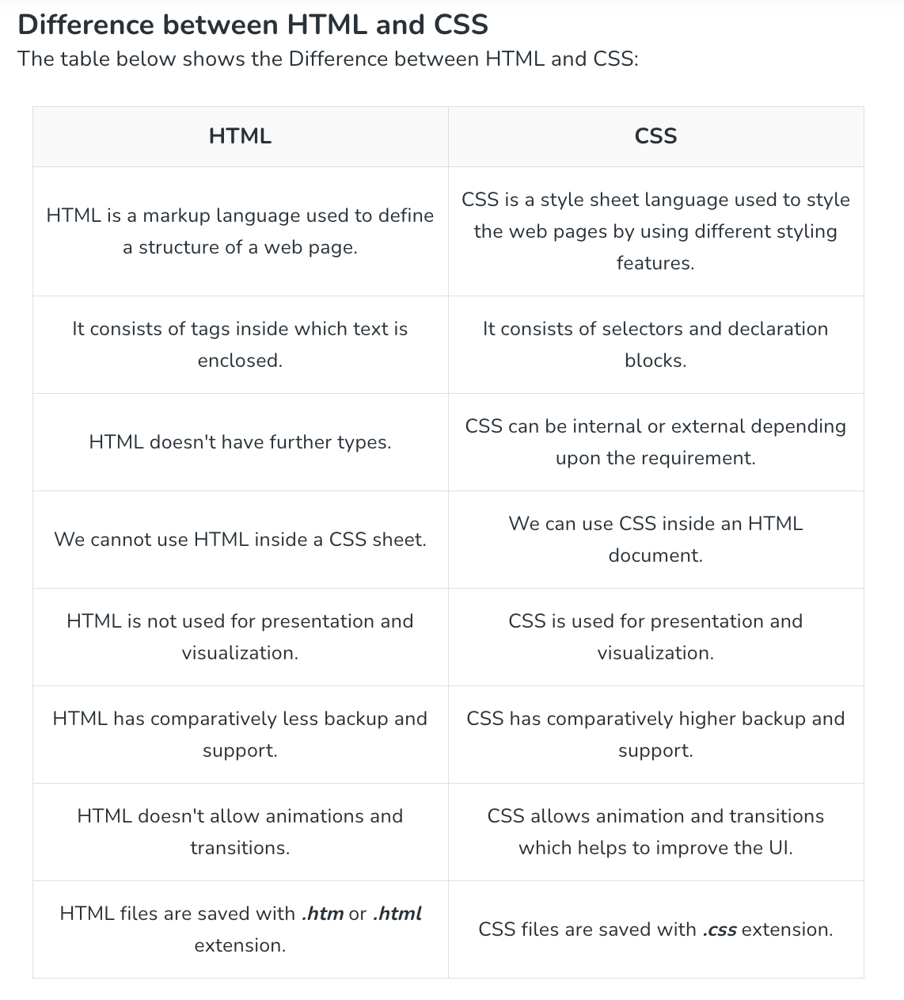
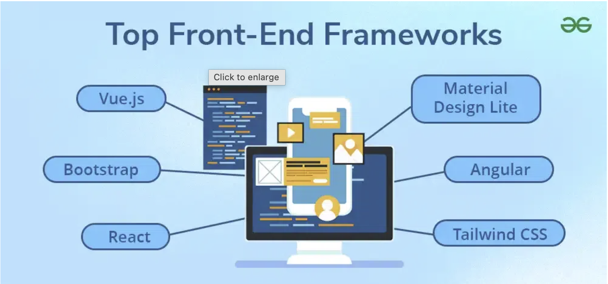

# HTML & CSS Practices

## What is HTML & CSS?
HTML is the standard markup language used to **create web pages**. HTML elements are the *building blocks of web pages*, allowing developers to embed multimedia, create forms, and design the overall layout.

CSS stands for Cascading Style Sheets and it is used to **style web documents**. It controls the layout, colors, fonts, and overall look of a web page. CSS is also recommended by World Wide Web Consortium (W3C)[https://www.w3.org/].



The above information is from Geeks for Geeks. 

### Common Frontend Frameworks
A web design framework offers a foundation that we can build upon, by eliminating repetitive coding by *offering pre-built components and a standardized structure*.



1. ***React*** is an open-source JavaScript library developed by **Facebook** in 2013 for building user interfaces. It lets developers create reusable, component-based UIs for web and mobile applications that can be combined into complex interfaces.
* **Pros:**
   * Fast rendering with Virtual DOM
       * *structured representation of a web page that the browser creates when it loads HTML*
   * Reusable components
   * Good performance and scalability

* **Cons:**
   * Steep learning curve
   * JSX can be confusing
       * *syntax extension for JavaScript used mainly with React. It lets you write HTML-like code directly inside JavaScript*
   * Setup can be complex
     
2. ***Tailwind CSS*** is a utility-first(*Instead of writing your own CSS, you use ready-made classes to style elements quickly.*) CSS framework used to quickly build responsive web designs using pre-built classes. It is highly customizable and provides many configuration options. It includes utility classes for layout, typography, colors, borders, shadows, and more, allowing developers to style elements efficiently without writing much custom CSS.
* **Pros:** 
   * Fast styling with utility classes
   * Highly customizable design system
   * Easy to build responsive layouts
   * Consistent UI across projects

* **Cons:**
   * Steep learning curve
   * Can feel cluttered in HTML
   * Requires optimization to avoid large builds
     
3. ***Angular*** is a TypeScript-based open-source front-end framework used for building dynamic single-page applications. It provides a structured, full-featured environment for developing large-scale web apps.
* **Pros:**
   * Two-way data binding
       * *The data changes → the UI updates automatically*
       * *The user changes the UI (like typing in a form) → the data updates automatically*
   * Built-in dependency injection
       * Instead of writing code to create dependencies manually, the framework “injects” (gives) them to you when needed.
   * Scalable and modular architecture
   * Reusable components
* **Cons:**
   * Steep learning curve
   * Complex for small projects
   * Large bundle size

### Tips from Forums: 
*   Keep your style and your markup separate
*   Don’t use inline styles, and don’t use `<i>`or `<b>` tags for styling.
*   Group elements in `<div>` tags
*   Cheat sheets are great, but it would probably be best to reference the [official documentation](https://html.spec.whatwg.org/multipage/)
*   Code = easy to understand and efficient
*   Avoid IDs or complex selectors. If you can use classes only for everything, that’s easier to extend.
* For styling:
  *   Component Framework - Using something like Bootstrap, Foundation or Bulma and building on that.
  *   Utility Framework - Something like Tailwind CSS which focuses on writing as little CSS as possible, and moving styling to classes on HTML.
*   You should end up with a smaller css in the end, because you're not repeating rules for each component with similar-yet-different design.
*   Start with HTML first because CSS is used to interact with the HTML visually.
* Use notes. Seriously. In both CSS and HTML.
  *   ```
      <!--Here starts (section)-->

      <!--Here ends (section)-->

      //CSS for (section)

      //CSS for (section) mobile (0-768px)
      
      //CSS for (section) tablet (769-900px)
      ```


## Resources:
*   [FreeCodeCamp Forum](https://forum.freecodecamp.org/t/best-practices-in-html-css/37441)
*   [Reddit Forum](https://www.reddit.com/r/Frontend/comments/b0snvb/frontenders_of_reddit_whats_the_best_practice_of/)
*   [GeeksForGeeks: *Difference between HTML and CSS*](https://www.geeksforgeeks.org/css/difference-between-html-and-css/)
